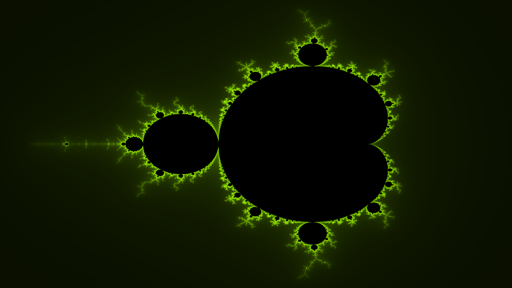
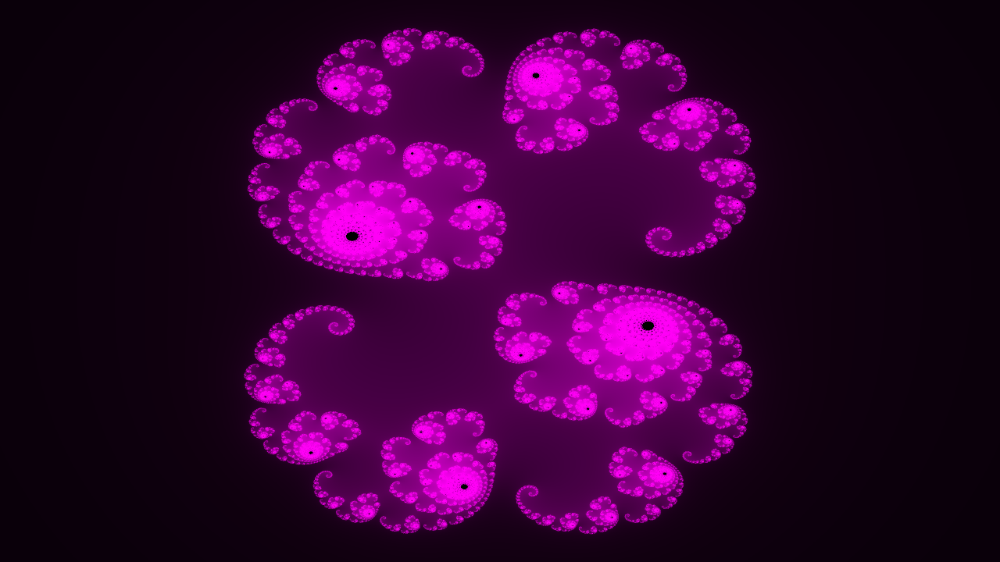
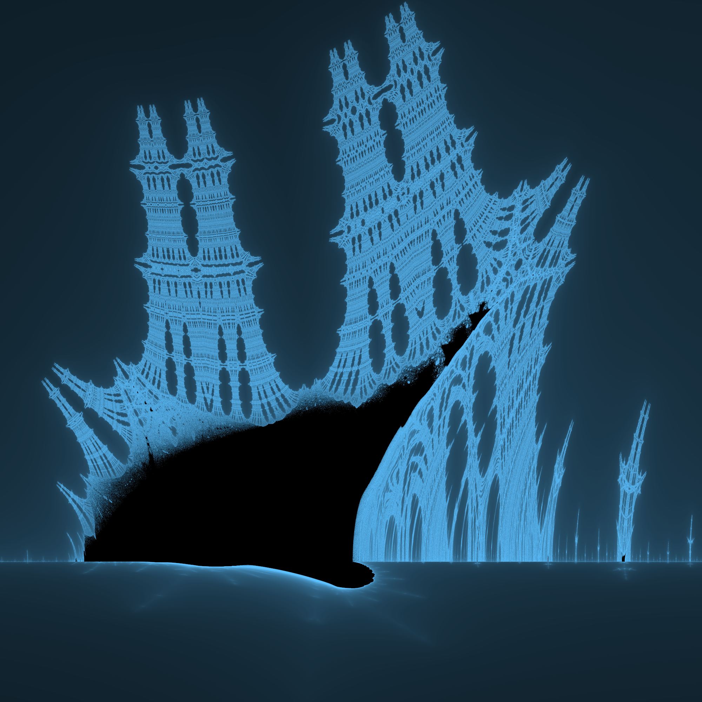

# FractalGen
A high-performance fractal generation package written in Python and accelerated with Numba.

The following fractals are implemented:
1. **Mandelbrot** (multi-core, CUDA)
2. **Julia** (multi-core, CUDA)
3. **Burning Ship** (multi-core, CUDA)
4. **Buddhabrot** (multi-core, CUDA)

## Gallery
Below are some fractals that can be generated with this package:
### Mandelbrot (originally 4K resolution)

### Julia (originally 4K resolution)

### Burning Ship (originally 10K resolution)

### Buddhabrot (originally 30K resolution, modified exposure)
